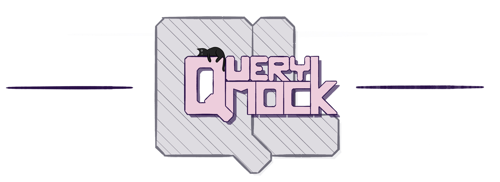
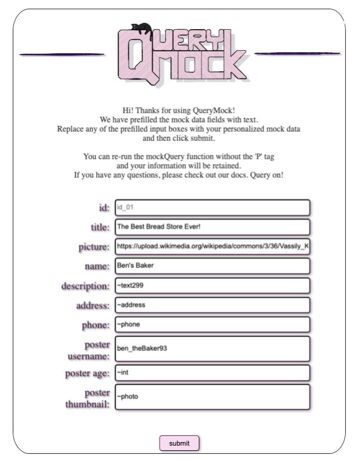

The QueryMock library is built for developers who are using Apollo, GraphQL, and React.

We currently have two books in our library:

    1)  mockQuery -> Which is a function that provides mock data for front end developers when the backend is not set up.
     
     
    2)  create-schema -> Which is a command line tool that will generate a mock schema using a provided query. NOTE: create-schema requires Apollo GraphQL to be installed.
 
 
 
<h1><b>INSTALLATION</b></h1>
<h2>Downloading The Package</h2>

To begin, fork this repo and then use the following code where you can access it in your project's file.
 
 
$ <code> git clone https://github.com/oslabs-beta/apollos_library.git</code>
​ 
 

It has some dependencies, so be sure to go to the file and enter:
​ 
 
$ <code> npm install</code>
​ 
 
Following that, enter:
​  
$ <code> npm install -g</code>
​ 
 
WARNING: Do not add the global flag during the inital npm install, this will cause an error when attempting to use create-schema.

 
 
<h1><b>USING QueryMock</b></h1>
​
<h2><b>TOOL #1:</b> The mockQuery() Method</h2>
<h3><b>DESCRIPTION:</b></h3> 
mockQuery is a temporary useQuery replacement, that provides mock data for front end development especially when the backend and/or schema have not been created.  The mockQuery method will provide you data so that you can visualize your front end code.
​
The idea is that while the backend is under construction, you would replace useQuery with mockQuery(), so that when your database is set up, you can swap them back and already know how everything will render on the page.

​
<h3><b>Importing The Method</b></h3>
In every page that you are running a GraphQL search and using the useQuery method, import QueryMock at the top of the page

​
<code>import al from '[your file path]/Query_Mock</code>
 ​
<h3><b>Implementing the Method</b></h3>

Wherever you are using the useQuery method, replace it like we do in the following code:
​ 
 
original code
 
 
<code>
  const { data } = <s>use</s>Query(gqlSearch) 
  ... do something with your data
</code>
 
 
replaced code
  
<code>
  const { data } = <u>al.mockQuery(gqlSearch, Arg2, Arg3, Arg4)</u> 
  ... do something with your data
</code>
 
 

If you have a query that uses variables, then you would do the following to your code
 
original code:
  
<code>
  const { loading, error, data } = <s>use</s>Query(GET_TRACK, {variables: { variableGoesHere }}, [optional additional arguements here])
   ...do something with your data
</code>
 
 
replaced code: 
<code>
  const { loading, error, data } = <u>al.mockQuery(GET_TRACK, {variables: { trackId }})</u>
  ...do something with your data
</code>
 
​
<h3><b>The Parameters</b>: <i>mockQuery(gql, obj, num, string)</i></h3>
​
1) The first paremeter must be a gql search, the same type of search used for Apollo's useQuery method. Here is link to the documentation for how those queries are constructed (https://www.apollographql.com/docs/react/data/queries/);
​ 
 
    Entering only 1 parameter will return mock/dummy data in string format.  If you're looking for different data types then see the functionality from the flag parameter.
​​ 
 
*The remaining arguments are optional and can be entered in any order or left out.*
​  
2) Enter an integer for the number of times you want your data duplicated.  You will receive an array with 1 object if you don't specifiy.  *please note that if you enter 1 or 0 then your data will return to you as an object.  If you enter anything greater than 1, your data will be returned to you as objects in an array.
​  
3) The object is for variables that you want to pass into your GraphQL query.  See this link for more info on using it with useQuery: https://www.apollographql.com/docs/react/data/queries/#caching-query-results.
​  
4) The flag can be either:
  - <code>'error'</code> - This will return an error so that you can test how your site will render with an error.
  
  - <code>'loading'</code> - This will return 'loading' so that you can test how your site will render while loading.
  
  - <code>'insert'</code> - (for personalization) A pop up window will appear with input boxes so that you can either enter the exact data you want to be displayed or you can choose a data type by placing a tilsde in front of specific words.
   
   
  Using the <i>"insert"</i> flag will cause a popup window to appear where you can personalize the data.  If you don't want to come up with your own data, then we supply some key words that you can use in order to populate your page with specific data: 
   
  
      Data Type Key Words:
    - to enter an <code>int</code> type:
      - <code>~int</code>
    
    - To enter a <code>float</code> type:
      - <code>~float</code>
    
    - To enter a block of text then enter the <code>~text</code> followed by how many characters you want.  The following example will return text with 15 characters, 75 characters, and 345 characters
      - <code>~text15</code>
      - <code>~text75</code>
      - <code>~text345</code>
​
    - To enter an <code>address</code> type:
      - <code>~address</code>
​
    - To enter a <code>phone</code> number type:
      - <code>~phone</code>
​
    - To enter a <code>photo</code> url then type:
      - <code>~photo</code>
​
 
 
<h3><b>Session Storage</b></h3>
The data will stay in your session storage until you close the browser.  Once you have your mock data set, then you can remove the flag argument and keep working on your page with the mock data provided.
 
 
 
<h2><b>TOOL #2:</b> create-schema CLI</h2>

<h3><b>DESCRIPTION:</b></h3> 
create-schema is a command line based tool that provides a mock schema based off of a provided query, making it extremely easy to start using GraphQL with very little setup.

 
<h3><b>How to use create-schema</b></h3>
Currently, in order to use create-schema, you must have a file that only contains <b>one</b> gql query. We're currently working on adding suport for multiple queries!
​ 
 
<h3>Example Query File: </h3>
 
<code>
const { gql } = require('apollo-graphql');</code>
 
 
<code>const dndChar = gql`</code>
​ 
<code>query class {</code>
​ 
<code>__class {</code>
​ 
<code>____name</code>
​ 
<code>____hit_die</code>
​ 
<code>____spellcasting {</code>
​ 
<code>______spellcasting_ability {</code>
​ 
<code>________name</code>
​ 
<code>______}</code>
​ 
<code>____}</code>
​ 
<code>__}</code>
​ 
<code>}</code>
​ 
<code>`;</code>
 
 
<!-- <code>module.exports = dndChar;</code> -->
​
NOTE: _ is acting as a stand in for a space in the above example.
 
 
​
​
After the file is created, the only information you need, to start using create-schema is the relative path of your file.
 
 
<h3><b>Implementing the Method</b></h3>
 
​
Once you have that information, type the following command into your terminal:
​ 
 
<code>create-schema</code>
​ 
 
After the command is run, follow the provided prompts to create your mock schema!
 
​
<h3>Example: </h3>
 
<code>create-schema</code>
​ 
 
->
 
​ 
<code>Where is your query stored? -> ./yourDir/yourQueryFile </code>
​ 
 
->
 
​ 
<code>Please declare the path where you would like your schema stored: -> ./yourDir/yourSchemaFile </code>
​ 
 
<b>NOTE:</b> If the provided path leads to a file that doesn't exist, the file will be created for you. If the path leads to a file that already exists, the mock schema will be placed under any data already present in the file.
​ 
 
After all prompts have been followed, the created mock schema will be displayed in the terminal. Currently, the default value is a string. We're working on adding support for more types, but at the moment any value other than a string will have to be manually added after the creation of the mock schema.
​
 
 
 
<h2><b>Next Steps:</b></h2>
We are hoping to deploy our product on npmjs as an installable package in the near future. This is our immediate next step. After that we want to ensure that we can implement the ability to return an array of objects that are deeply nested in a given query in regards to our first feature. For our second feature we are hoping to integrate more prompts for the user to dictate other data types they want to populate in their mock schema. Currently, it can only populate strings and it needs to be manually updated in the new file to account for any other possible data types. 
 
 
We are also interested in working on a third feature that 
addresses the issue of query handling in the Gateway with Apollo Federation. This isn't a fully-fleshed out idea, currently, however from what we could deduce there were some issues in regard to how node queries were specifically being handled by the Gateway when working with React Relay. 

 
 
<h2><b>Meet The Team</b></h2>
QueryMock is currently a team of four software engineers, excited about the possibilities of Apollo GraphQL. Here is our team:
 
 
Jacob Jurado:
 
    - github: https://github.com/jakejurado
 
    - linkedin: https://www.linkedin.com/in/jacob-jurado/
 
 
Autumn Wallen:
 
  - github: https://github.com/Autumn-Wallen
 
  - linkedin: https://www.linkedin.com/in/autumn-wallen/
 
 
Ziquan “ZQ” Deng:
 
  - github: https://github.com/ZQland
 
  - linkedin: https://www.linkedin.com/in/ziquan-deng/
 
 
Jamie Clignett:
 
  - github: https://github.com/jamie-clignett
 
  - linkedin: https://www.linkedin.com/in/jamie-clignett/

 
 
<b>Thank you!</b>
 
We appreciate you taking the time to read our article. If you find this product useful or if you are curious to know more, feel free to visit our github repository, and our splash page!  Soon we will be launching this on npmjs, so that you can directly install our package from there. 
 
  
Special thanks to Katherine Kim for mentoring and giving us guidance. 
 
 
We would also like to thank Natalie Klein, Mike Masatsugu and Alexander Holden for supporting us in our creation of Query Mock. 

